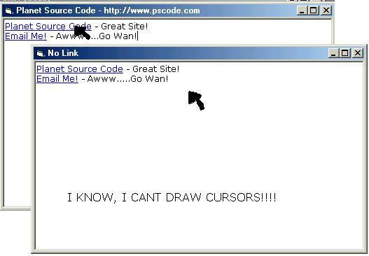



## Rich Text Box Links\.\.\.Easy Example

### Description

lets you add cursors to a rich text box....really easy code too :)
 
### More Info
 

             |
---                |---
**Submitted On**   |2001-09-02 19:00:42
**By**             |[MudBlud](https://github.com/Planet-Source-Code/PSCIndex/blob/master/ByAuthor/mudblud.md)
**Level**          |Intermediate
**User Rating**    |4.3 (17 globes from 4 users)
**Compatibility**  |VB 4\.0 \(32\-bit\), VB 5\.0, VB 6\.0
**Category**       |[VB function enhancement](https://github.com/Planet-Source-Code/PSCIndex/blob/master/ByCategory/vb-function-enhancement__1-25.md)
**World**          |[Visual Basic](https://github.com/Planet-Source-Code/PSCIndex/blob/master/ByWorld/visual-basic.md)
**Archive File**   |[Rich Text 25774922001\.zip](https://github.com/Planet-Source-Code/mudblud-rich-text-box-links-easy-example__1-26903/archive/master.zip)

### API Declarations

SendMessage

